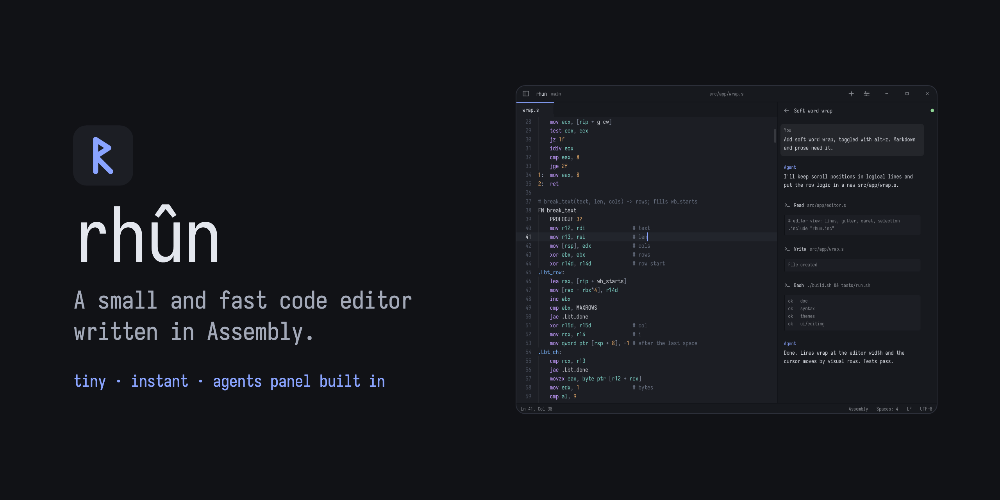
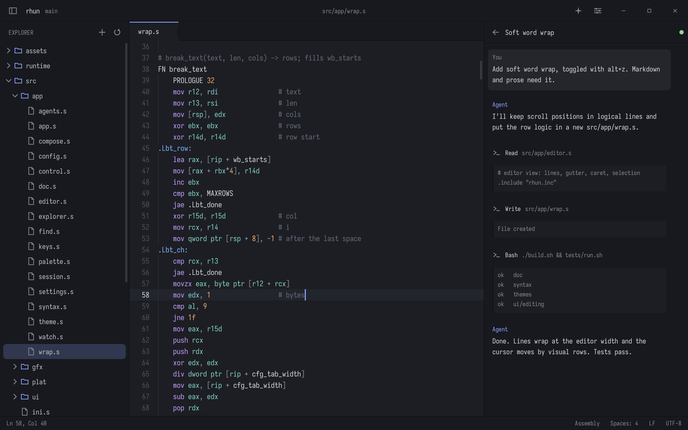
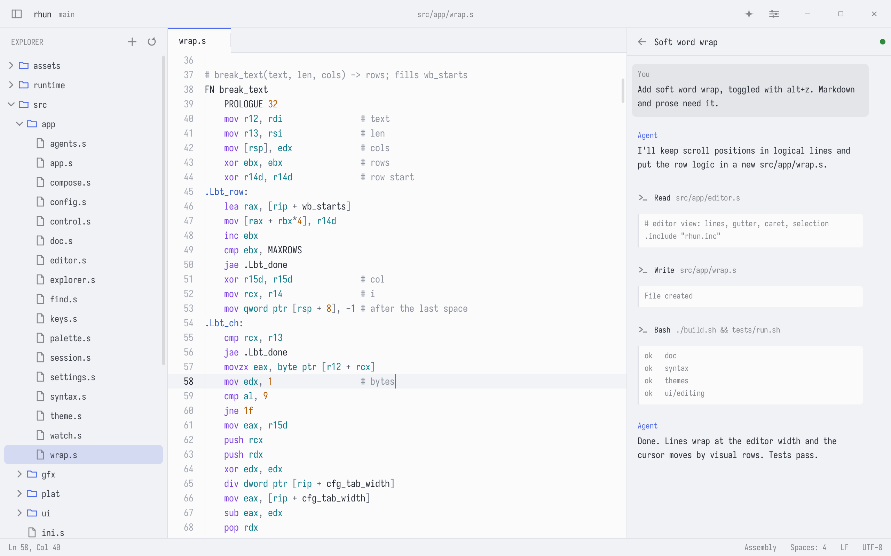
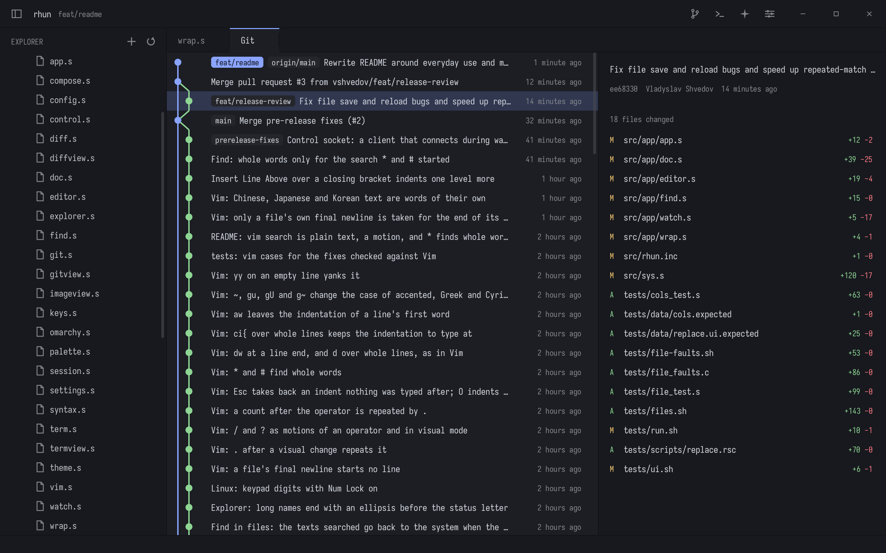

# rhun



## Get rhun

On Linux (x86-64) or macOS (Apple silicon), run:

```sh
curl -fsSL https://github.com/vshvedov/rhun/releases/latest/download/install.sh | sh
```

Or using `wget` 

```sh
wget -qO- https://github.com/vshvedov/rhun/releases/latest/download/install.sh | sh
```

rhun shows up with your other apps, and `rhun` starts it from a terminal. It keeps itself up to date: when a new version is out, the status bar offers it.

## Why rhun

When coding agents do more of the heavy lifting, you may not need everything that comes with VS Code or Zed. You need to read and edit code, run commands, find files, and check what changed.

rhun has the parts you use every day:

- **Edit code.** Tabs, syntax highlighting, find and replace, and optional Vim mode.
- **Use your terminal.** Run your shell, tools, and coding agents right beside the code.
- **Check Git.** See changed files, read diffs, and browse commit history.
- **Find things.** Jump to a file or search across the whole project.
- **Follow your agents.** See Claude Code and Codex sessions as they work.

<p>
  
  
</p>

Pick from 39 light and dark themes. On Omarchy, choose **Follow Omarchy** and rhun switches themes with your desktop.

Keep your terminal beside your code, and browse Git history without leaving the editor.

<p>
  
  
</p>

[Usage, shortcuts, and configuration](docs/guide.md)

[MIT license](LICENSE). Built-in fonts: [SIL Open Font License](assets/fonts/LICENSE-Iosevka.md).
